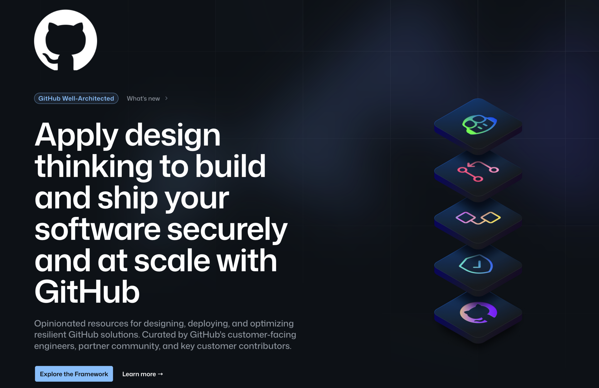

嗨，朋友们，

Cloudflare 收购了 Astro。Anthropic 收购了 Bun。开源项目找到了可持续的归宿，两个项目都保持 MIT 许可证，团队不变。更多竞争，更好的工具。全是好消息。

Astro 特别的地方在于它的设计哲学。Content Collections 就是个完美的例子：定义 schema，声明类型，如果 frontmatter 不匹配，构建直接失败。不会有生产环境的惊喜。这就是有意识的架构设计。

```typescript
// src/content/config.ts
const blog = defineCollection({
  schema: z.object({
    title: z.string(),
    date: z.date(),
    draft: z.boolean().default(false),
  }),
});
```

同样的思维方式到处适用。GitHub 的 [Well-Architected 框架](https://wellarchitected.github.com/)也在问同样的问题：你的开发环境怎么设计。别只是打开功能，要根据你真正的需求来设计。

框架会变，平台会整合。有意识的设计思维到哪都适用。

## 🚢 新动态

### GitHub Well-Architected

如果你正在为团队或组织搭建 GitHub 环境，[Well-Architected 框架](https://wellarchitected.github.com/)给你一个结构化的思考方式。生产力、协作、应用安全、治理、架构。



每个支柱都有评估清单可以过一遍。举个反模式的例子：过度工程化——构建不必要的复杂方案或添加没有明确价值的功能。框架的建议很简单：专注于解决当前问题，而不是预判未来需求。

听着耳熟吧？跟 Content Collections 的思路一模一样。交付你需要的，定义你期望的，其他的跳过。

[查看完整的反模式列表](https://wellarchitected.github.com/library/scenarios/anti-patterns/)

## 📺 在看什么

### Lex Fridman Podcast #489: Paul Rosolie

[Paul Rosolie](https://www.youtube.com/watch?v=Z-FRe5AKmCU) - 跟代码没关系。Paul 是一位博物学家，花了 20 年保护亚马逊雨林。2024 年 10 月，他与一个未接触过外界的部落有了一次完整的相遇。当被问到他怎么活下来的，他说动物做决定，他只是学会了读懂它们，让自己不被杀死。

如果你想从技术内容中歇口气，但又想看点让你重新思考解决问题方式的东西，值得一看。

## 🔧 在用什么

### Astro Islands

我的个人[网站](https://andreagriffiths.dev/)基本是静态内容，只有一个交互组件：一个带 Mona 的终端。Islands 让我把内容以 HTML 形式发送，只对那个终端做 hydrate。文字瞬间加载，好玩的部分照样能用。

### Astro 小技巧

大多数人知道 `client:visible` 用于懒 hydration。但更少人知道 `client:media`。给组件加上 `client:media="(min-width: 1024px)"`，它在移动端就完全不会 hydrate。我的终端只在桌面端加载，因为只有那里用得上。

## ✨ 这周

GitHub 线下活动回来了，期待把我们规划的那些酷东西都发出来！社交电量已空但心是满的，我爱我的团队！

我准备在我的 [YouTube 频道](https://www.youtube.com/@Acolombiadev) 开一个每周直播，聊 Main Branch 的内容。每周一晚 8 点 ET。能来的来，来不了的看回放。

就这些。框架找到新家，基本功不会变。

觉得有用就转发给你的团队。想看什么内容就回复告诉我。

感恩，下周见，

Andrea